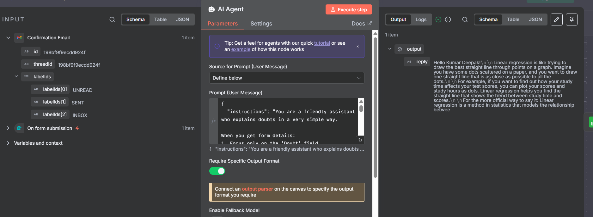

# Doubt Solver Workflow – n8n + AI + Google Sheets

## 📖 Overview

This is my **second workflow** built using **n8n** (Day 2 of my journey 🚀).
The workflow acts as a **Doubt Solver Bot**:

1. Takes user doubts through a form.
2. Notifies the workflow owner by email.
3. Uses **AI (OpenAI Chat Model)** to generate clear answers.
4. Saves both the doubt & answer in Google Sheets.
5. Sends the answer back to the user automatically.

It’s like having an **AI teaching assistant** available 24/7.

---

## ✨ Features

* 📥 Collects user doubts via an n8n form.
* 📩 Notifies the owner of new submissions.
* 🤖 AI Agent (OpenAI Chat Model) generates a structured answer.
* 📊 Saves all submissions & responses in Google Sheets.
* 📧 Sends a confirmation + solution email to the user.
* ⚡ Fully automated — no manual intervention.

---

## 🛠️ Workflow Steps

### 1. **Form Trigger**

* Fields: Name, Email, Phone, Doubt, Submitted Time.
* Triggered when a user clicks **Submit**.

📸 *Screenshot:* 

---

### 2. **Send Email to Owner**

* Sends a notification email to the workflow owner.
* HTML email layout shows: Name, Email, Phone, Doubt.

📸 *Screenshot:* 

---

### 3. **AI Agent (OpenAI Chat Model + Structured Output Parser)**

* Passes the doubt to **OpenAI Chat Model**.
* Uses a **Structured Output Parser** to ensure clean, clear responses.
* Prompt is designed to give simple, easy-to-understand answers.

📸 *Screenshot:* 

---

### 4. **Append Row in Google Sheets**

* Stores: Name, Email, Phone, Doubt, Answer.
* Creates a permanent record of all submissions.

📸 *Screenshot:* 

---

### 5. **Send Email Back to User**

* Sends a confirmation + AI-generated answer to the user.
* Styled HTML email for readability.

📸 *Screenshot:* 

---

## 🚀 Getting Started

### Prerequisites

* n8n account (Cloud or Desktop)
* Google Sheets API access
* Gmail API access (for sending emails)
* OpenAI API Key
* *(Optional)* AI like ChatGPT can help you craft the perfect prompts

---

### 🔧 Setup Instructions

1. **Import the workflow**

   * In n8n, go to *Import Workflow* and upload `n8nDoubtSolver.json`.

2. **Set up Google Sheets credentials**

   * Enable Google Sheets API in your Google Cloud project.
   * Connect your Google account in n8n.

3. **Set up Gmail credentials**

   * Enable Gmail API.
   * Connect your Gmail account in n8n.

4. **Set up OpenAI credentials**

   * Generate an API key from [OpenAI](https://platform.openai.com).
   * Add it under *Credentials → OpenAI API* in n8n or You can use the 100 free credits given by n8n.

5. **Customize Email Templates**

   * Edit the HTML layouts for owner and user emails if needed.

6. **Activate the Workflow**

   * Toggle the workflow **Active** in n8n.
   * Copy the **Production Form URL** from the Form Trigger node.

---

## ▶️ How to Use & Run in Your System

1. Open the **Form URL** in your browser.
2. Fill in the form with test details:

   * Name
   * Email
   * Phone Number
   * Your Doubt
3. Click **Submit**.
4. The workflow will automatically:

   * Notify the owner by email.
   * Send the doubt to AI → generate an answer.
   * Save everything in Google Sheets.
   * Send the reply back to the user’s email.
5. Verify results:

   * ✅ Owner inbox → “New Doubt Received” email.
   * ✅ User inbox → Answer email with details.
   * ✅ Google Sheets → Row with submission + AI answer.

📸 *Workflow Screenshot:* 

---

## 🎯 Use Cases

* Student doubt resolution
* Customer FAQ automation
* Internal employee query handling
* Instant support bots

---

## 📎 Links

* 🔗 **Official n8n Website:** [https://n8n.io](https://n8n.io)

---

## 📜 License

This project is open-source and available under the [MIT License](../Automation-2_Doubt_Solver_Using_Single_Ai_Agent/LICENSE).

---
